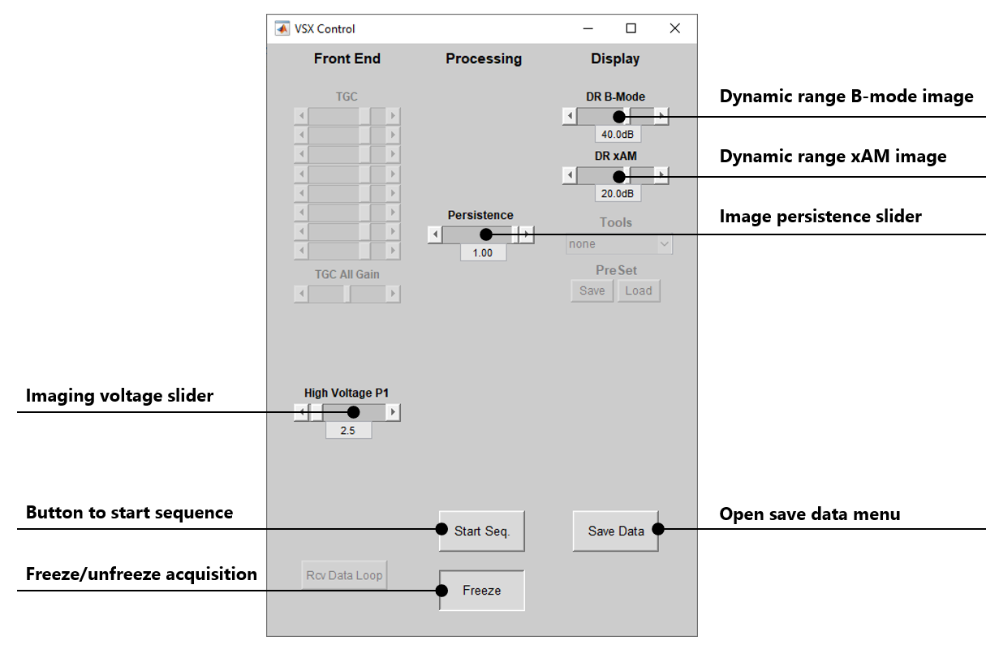

# xAM-imaging

Repository containing script that implements the xAM imaging sequence for
artifact-free detection of gas vesicles (GVs). By transmitting cross-propagating
plane waves, xAM suppresses nonlinear propagation artifacts while preserving
nonlinear contrast from GVs. 

[](LICENSE)
[]()
[]()


## How to use

### 1. Parameter Review

Open the imaging sequence `xAM_imaging.m` and review the following parameters: 

```matlab
Trans.name = 'L22-14vX';        % tested transducers are L22-14v / L11-5v
P.image_start_depth_mm = 0;     % start depth [mm]
P.image_end_depth_mm = 10;      % end depth [mm]
P.xwave_angles = 17;            % xWave angle in degrees, check if max depth can be reached! 
P.speed_of_sound = 1480;        % agar/water 1480 m/s, tissue 1540 m/s
P.image_voltage = 2.5;          % set to safe number to avoid collapse
P.save_path = 'data';           % default path for data saving
```

Other parameters that can be configured are described below. 

### 2. Launch imaging sequence
Run the script `xAM_imaging.m` to start imaging. The VSX GUI will pop up.



When it is safe, if the ultrasound transducer is in contact with the phantom,
water or other, press the button "Start Sequence". Next, xAM data will be acquired
continuously and displayed on screen, side by side with a B-mode image. 

### GUI Controls

| Control               | Description |
|-----------------------|-------------|
| **Start Seq.**        | Starts the imaging sequence. After launching the script, the GUI window opens (if parameters are valid). When the transducer is in contact with the imaging medium, press **Start Seq.** to unpause the hardware and begin continuous acquisition. |
| **Freeze/Unfreeze**   | Pauses or resumes the sequence. Only works after the sequence has been started with **Start Seq.** |
| **Save Data**         | Opens the save menu to set path and filename. Requires the sequence to be frozen before saving; the current on-screen image will then be saved. |
| **Imaging Voltage**   | Controls the transmit voltage. Start with a low voltage to avoid collapsing gas vesicles. At too low voltages, nonlinear signal in the xAM images may not appear since the GV buckling threshold is not reached. Slowly increase the voltage until nonlinear signal is observed. |
| **Persistence**       | Controls image persistence by blending new frames with previous ones. **1.0 = only new frame (no persistence)**, **0.0 = only old frame**. Intermediate values apply a moving average for smoother, more stable images. |
| **Dynamic Range B-mode** | Adjusts the dynamic range used for display of the B-mode image. |
| **Dynamic Range xAM** | Adjusts the dynamic range used for display of the xAM image. |

### Parameter Reference

| Name                   | Description                                                                              |
| ---------------------- | ---------------------------------------------------------------------------------------- |
| `image_start_depth_mm` | Start depth of imaging region \[mm]                                                      |
| `image_end_depth_mm`   | End depth of imaging region \[mm]                                                        |
| `xwave_angles`         | xWave angle \[degrees]                                                                   |
| `speed_of_sound`       | Speed of sound in medium (1480 m/s in water/agar, 1540 m/s in tissue)                    |
| `image_voltage`        | Transmit voltage \[V]. Set safely to avoid GV collapse                                   |
| `aperture_size_min`    | Minimum number of elements in active aperture (e.g. 48 for wide FOV)                     |
| `aperture_size_max`    | Maximum number of elements in active aperture                                            |
| `transmit_apodization` | Apodization function to reduce edge waves. Options: <br> `none`, `kaiser`, `hamming`, `tukey` |
| `fps`                  | Acquisition frame rate \[Hz]                                                             |
| `save_path`            | Default path for saving data                                                             |

### Advanced options

| Name                       | Description                                                                     |
| -------------------------- | ------------------------------------------------------------------------------- |
| `num_accumulations`        | Number of RF accumulations. Increases SNR but lowers FPS and risks clipping of signals     |
| `use_adaptive_xwave_angle` | If true, xWave angles are adapted based on imaging depth                        |
| `use_half_pitch_scanning`  | Enables half-pitch scanning for finer sampling                                  |
| `transmit_frequency`       | Transducer transmit frequency \[MHz]                                            |

### Notes

- Tested on MATLAB R2021b on Windows 10, with Verasonics Vantage-4.8.6. 
- You require a Verasonics host PC with GPU, since the sequence uses a GPU
accelerated beamformer. 

## Feedback, Feature Requests, and Bug Reports

We welcome contributions from users and developers!  
- **Found a bug?** Please open an [issue](../../issues) with a clear description and steps to reproduce.  
- **Have a feature request?** Open an [issue](../../issues) and label it as `enhancement`.  
- **General feedback or suggestions?** Use the [feedback template](../../issues/new/choose) to share your thoughts.  

Your input helps improve this repository and guide future development.


## References to be cited 

- Maresca, D., Sawyer, D. P., Renaud, G., Lee-Gosselin, A., & Shapiro, M. G.
  (2018). Nonlinear X-wave ultrasound imaging of acoustic biomolecules. Physical
  Review X, 8(4), 041002, DOI:
  [10.1103/PhysRevX.8.041002](https://doi.org/10.1103/PhysRevX.8.041002)
- Matalliotakis, A., Waasdorp, R., Verweij, M. D., & Maresca, D. (2024). Impact
  of wavefront shape on nonlinear ultrasound imaging of monodisperse
  microbubbles. Physical Review Applied, 22(3), 034062, DOI: [10.1103/PhysRevX.8.041002](https://doi.org/10.1103/PhysRevApplied.22.034062)


## Disclaimer
This software is provided by the authors and contributors "as is" and any express or implied warranties, including, but not limited to, the implied warranties of merchantability and fitness for a particular purpose are disclaimed. In no event shall the authors and contributors be liable for any direct, indirect, incidental, special, exemplary, or consequential damages (including, but not limited to, procurement of substitute goods or services; loss of use, data, or profits; or business interruption) however caused and on any theory of liability, whether in contract, strict liability, or tort (including negligence or otherwise) arising in any way out of the use of this software, even if advised of the possibility of such damage.

